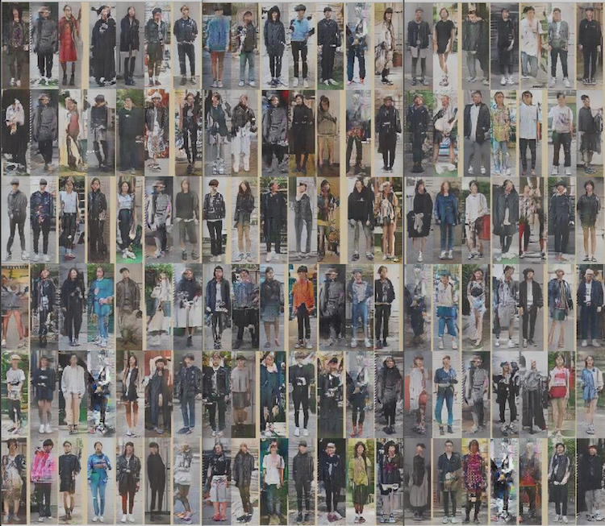

# Word2Image

## Deep Convolution Generative Adversarial Networks

#### Original Source : [dcgan.torch](https://github.com/soumith/dcgan.torch)

### DataSet

Dataset is street snap images(128x128).

### Generative Image

This network is generate images of 128x128 pixels.    
These are generated images by DCGAN.

## Word2Vec

Use Pre-trained Model : [GoogleNews-vectors-negative300](https://drive.google.com/file/d/0B7XkCwpI5KDYNlNUTTlSS21pQmM/edit)

## Integration

- translator(Ko => En) -> Word2Vec(Pre-trained model)
	- similarity(input_text, gender_words, category_words)
		- Find Best Match Image => Generate Image.
	- Image Analysis(Gender, Category)
- DCGAN          -> Discriminator Model(Good / Bad)
